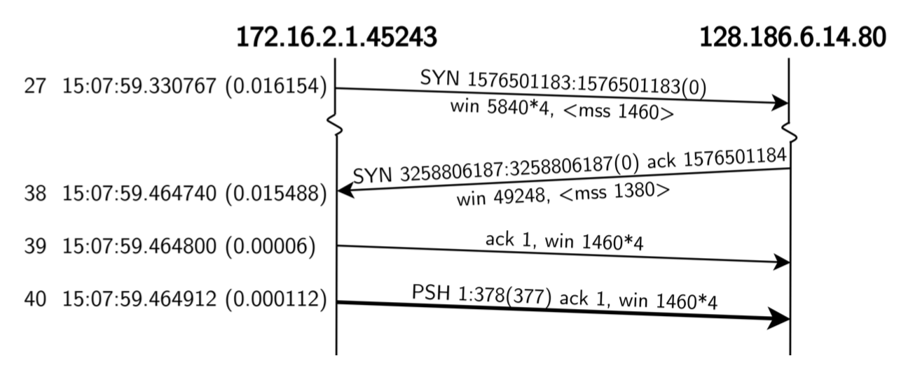

# TCP ANALYSIS AND VISUALISATION

#### To run
Maven build, compile and run `DisApplication` with the endpoint: http://localhost:8080/

The goal of this project is to create `Steven's Time Line Diagrams`, like this one:

from `pcap` files.

